# QRview

É um projeto de aplicativo para dispositivos móveis com a finalidade de facilitar a aquisição de dados, usando um QRcode como um ID para acessar um banco de dados/servidor, a fim de manter um acesso fácil e organizado das informações salvas pelo usuário. Tem suporte para guardar textos, imagens/gifs, audios, videos, temporizador e localização de mapa.

## Screenshots:
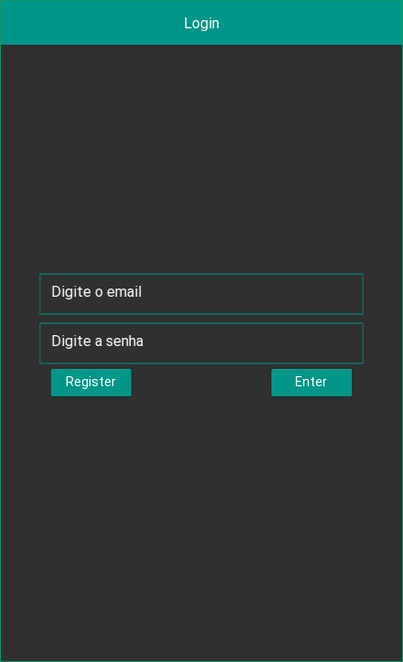
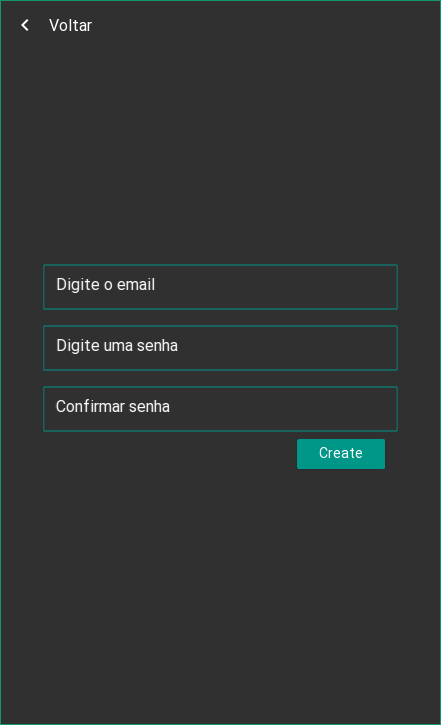
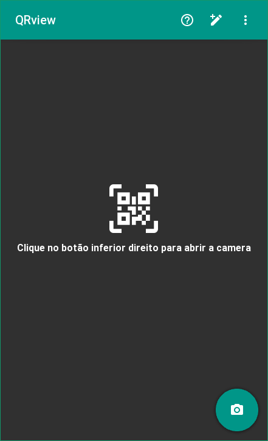
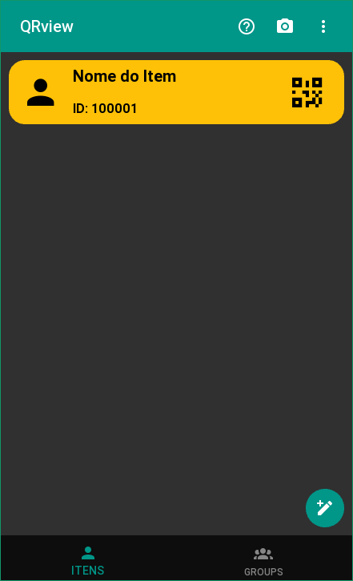
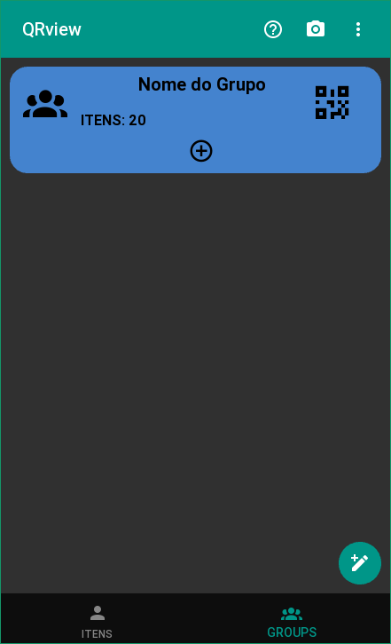
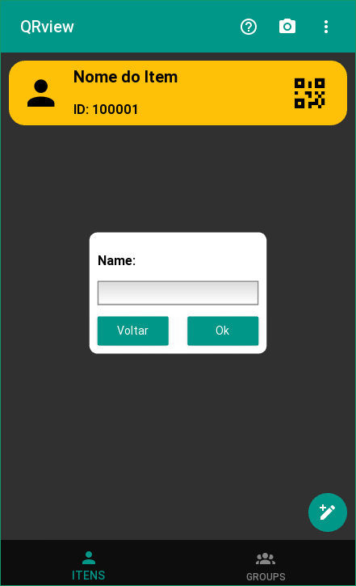
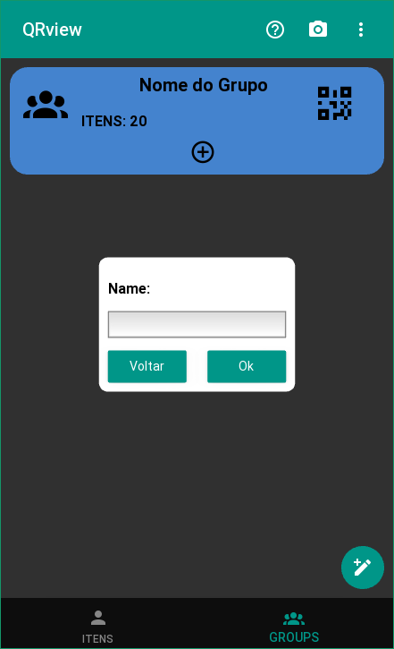
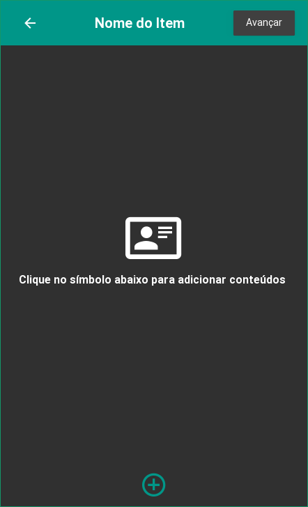
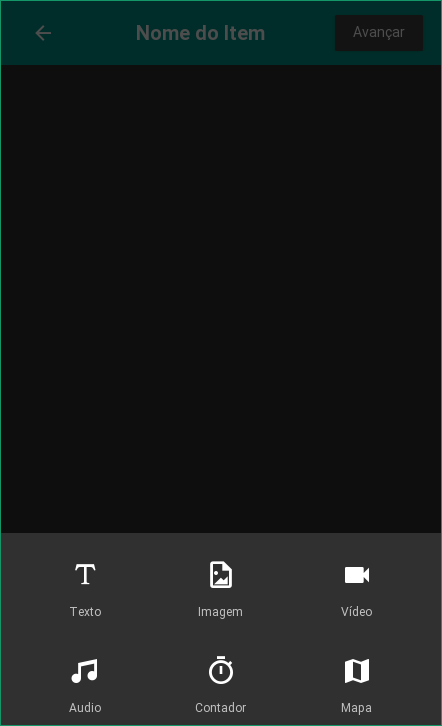
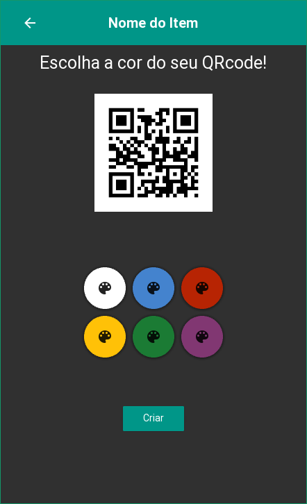
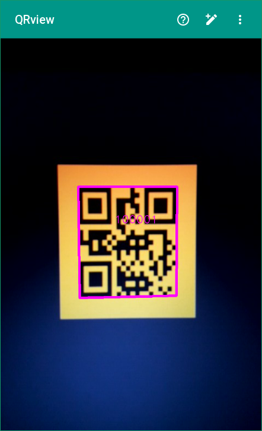
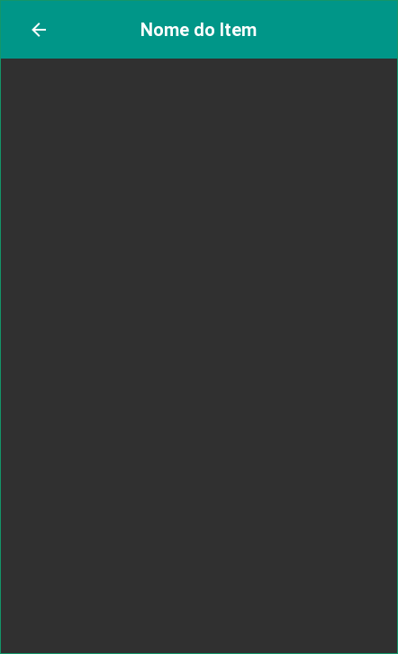

## Widgets suportados:

### *Caixa de Texto*
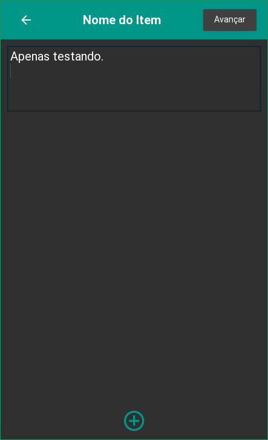

### *Imagem / GIF*
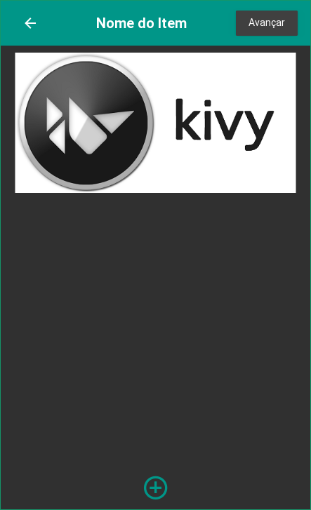

### *Audio*
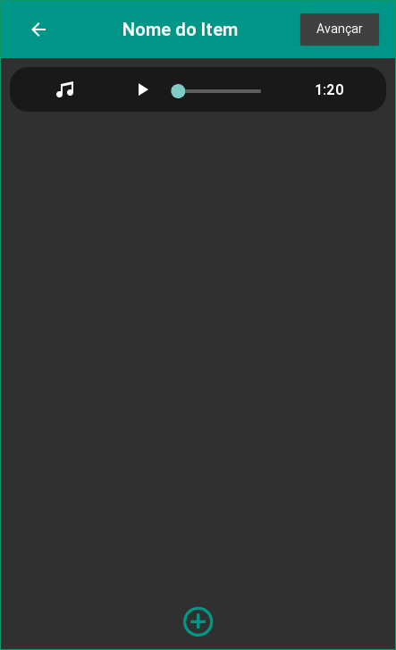

### *Video*
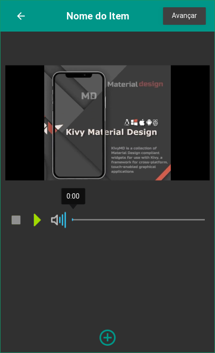

### *Temporizador*
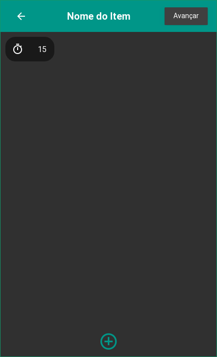

### *Mapa*
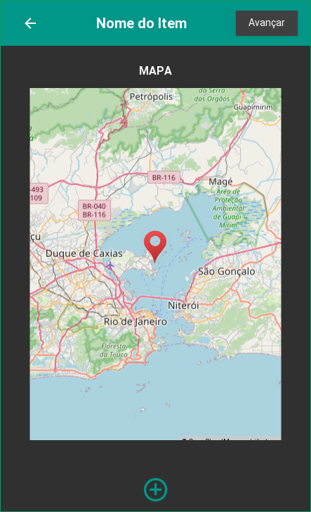